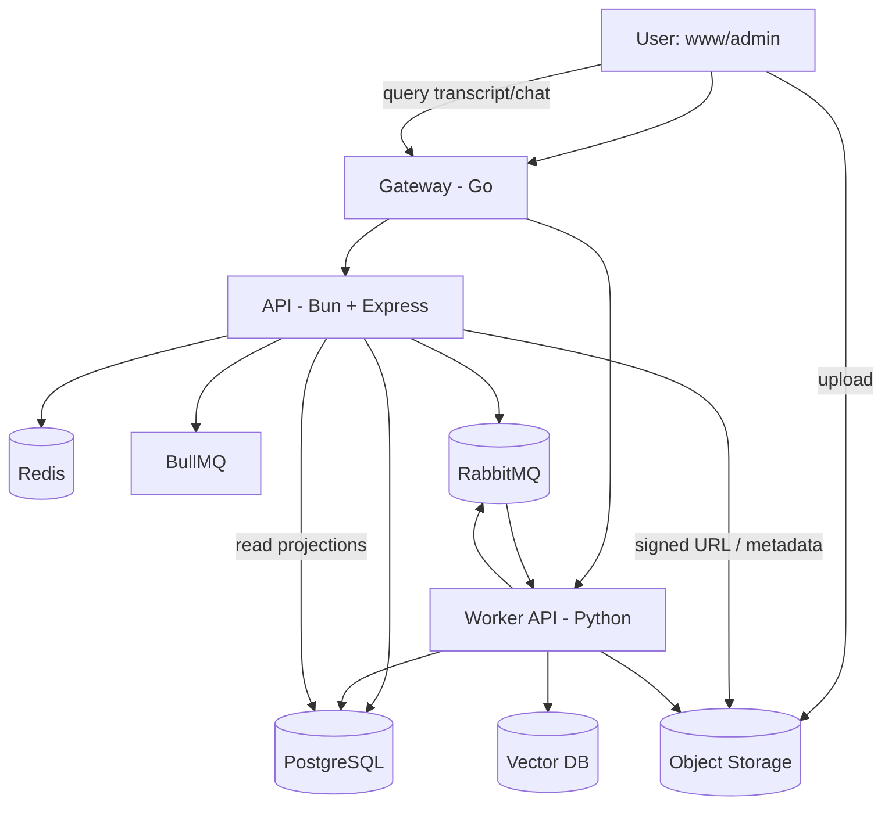
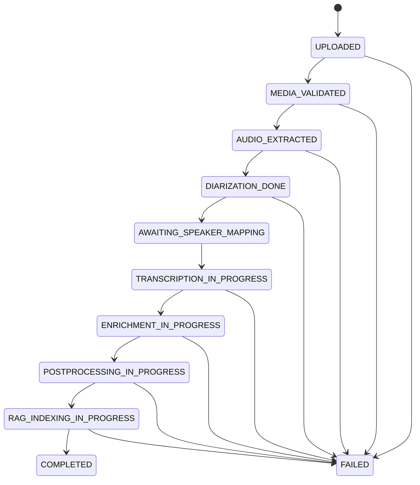

# WORKFLOW.md

## 0) Purpose
This document is the implementation workflow and architecture blueprint for the SpeakTrace B2B SaaS platform.
It combines the requirements in `IDEA.md` + `HLD.md` and maps them to the service split:

- `www/` → Next.js customer-facing app
- `gateway/` → Go API gateway + inter-service request routing
- `api/` → Bun + Express backend (Postgres, Redis, BullMQ, RabbitMQ integration)
- `worker/` → Python AI processing service (diarization, ASR, emotion, RAG indexing + QA)

---

## 1) Product Outcome (North Star)
A user uploads audio/video, then:

1. File is stored durably.
2. Worker extracts audio (if video), performs diarization.
3. System pauses and asks user to map speakers ("Speaker A = John").
4. Worker resumes full transcription + punctuation + optional emotion tagging.
5. Post-processing engine creates downloadable outputs (TXT, JSON, VTT, custom template).
6. Transcript is indexed in RAG.
7. User can ask natural-language questions with timestamp-aware answers (e.g., "What happened at 23:05?").

---

## 2) Architecture (Clean Service Boundaries)



### Why this split
- **Gateway** centralizes auth propagation, rate limiting, request tracing, and stable public API surface.
- **API** owns business logic + tenancy + job lifecycle + billing + permissions.
- **Worker** owns AI/ML compute and long-running async workloads.
- **RabbitMQ** is the cross-service event backbone.
- **BullMQ/Redis** handles API-local task orchestration (timeouts, retries, delayed checks).

---

## 3) End-to-End Workflow (Event-Driven State Machine)



### Pause/Resume checkpoint (critical)
- After diarization, job enters `AWAITING_SPEAKER_MAPPING`.
- API emits user notification event.
- User labels speakers in UI.
- API publishes `speaker.mapping.submitted` event.
- Worker resumes pipeline.

---

## 4) Queue and Event Contract

## 4.1 RabbitMQ exchanges/topics (cross-service)

- `media.uploaded`
- `media.validated`
- `audio.extracted`
- `diarization.completed`
- `speaker.mapping.required`
- `speaker.mapping.submitted`
- `transcription.completed`
- `enrichment.completed`
- `postprocessing.completed`
- `rag.indexing.completed`
- `job.completed`
- `job.failed`
- `job.progress.updated`

### Standard event envelope (all services)
```json
{
  "event_id": "uuid",
  "event_type": "diarization.completed",
  "occurred_at": "ISO-8601",
  "tenant_id": "uuid",
  "project_id": "uuid",
  "job_id": "uuid",
  "correlation_id": "uuid",
  "idempotency_key": "string",
  "payload": {}
}
```

## 4.2 BullMQ roles (inside API)
- Polling external job status if needed
- SLA timeout checks
- Notification fanout/retries
- Dead-letter compensation jobs

---

## 5) Service Responsibilities

## 5.1 `gateway/` (Go)
- JWT/session verification and forwarding of identity claims
- API routing:
  - `/v1/*` → `api/`
  - `/v1/worker/*` (admin/internal only) → `worker/`
- Rate limiting per tenant + endpoint
- Unified request/response logging and tracing headers
- WebSocket pass-through for live job updates (optional first, then add)

## 5.2 `api/` (Bun + Express + Postgres + Redis + BullMQ + RabbitMQ)
- AuthN/AuthZ, RBAC, organization/tenant model
- Upload initiation (signed object storage URLs)
- Job creation + lifecycle projection + status APIs
- Speaker-label submission endpoint
- Export request orchestration
- Billing, quotas, and usage metering
- Emits/consumes RabbitMQ domain events

## 5.3 `worker/` (Python + LangChain stack)
- Media normalization and audio extraction
- Speaker diarization
- ASR transcription
- Optional emotion + punctuation enrichment
- Post-processing and format rendering
- RAG chunking, embeddings, indexing, and QA chain
- Publishes progress + completion/failure events

## 5.4 `www/` (Next.js user app)
- Upload UX + job list + progress UI
- Speaker labeling workflow (play clips, map speaker → name)
- Transcript viewer (time-linked)
- Export management UI
- Chat-with-transcript UI

## 5.5 `admin/` (Next.js admin app)
- Tenant/account management
- Job audit and failure triage
- Cost dashboards (token usage, compute time)
- Support tooling (requeue/retry/kill)

---

## 6) Data Model (Core Tables)

- `tenants`
- `users`
- `projects`
- `media_assets`
  - original upload key, mime type, duration, checksum
- `processing_jobs`
  - state, progress_pct, current_stage, started_at, ended_at, error
- `speaker_profiles`
  - `job_id`, `speaker_tag` (A/B/C), `display_name`
- `transcript_segments`
  - `job_id`, `start_ms`, `end_ms`, `speaker_id`, `text`, `emotion`, confidence
- `exports`
  - format, template, output_uri, status
- `rag_documents`
  - chunk metadata, embedding refs, timestamps
- `chat_sessions` / `chat_messages`

### Multi-tenant rules
- Every row carries `tenant_id`.
- Gateway/API enforce tenant isolation on every query.
- Object storage paths namespaced by tenant/project/job.

---

## 7) Storage Strategy

- **Object Storage (S3-compatible)**
  - `/tenant/{tenantId}/project/{projectId}/job/{jobId}/input/*`
  - `/.../intermediate/*`
  - `/.../output/*`
- **Postgres** for authoritative metadata + transcript segments
- **Redis** for caching + BullMQ infra
- **Vector DB** (start with pgvector or dedicated vector store later)

Recommendation:
- Start with **pgvector** for speed of delivery.
- Move to dedicated vector DB only when scale/latency requires it.

---

## 8) AI/ML Pipeline Details

## 8.1 Ingestion + normalization
- Validate mime type and duration limits
- Convert all media to canonical WAV/16k mono (or model-required format)
- Store normalized artifact for reproducibility

## 8.2 Diarization
- Detect speaker turns with timestamps
- Extract 2–3 sec clean samples per detected speaker for UI labeling
- Emit `speaker.mapping.required`

## 8.3 Transcription
- Run ASR with diarization-aligned segments
- Merge text with speaker identities once mapping is available

## 8.4 Enrichment (optional flags)
- Punctuation normalization
- Emotion tagging per segment

## 8.5 Post-processing
- Render canonical JSON transcript first
- Convert canonical JSON into target formats:
  - TXT
  - VTT
  - custom user template grammar

## 8.6 RAG indexing + QA
- Chunk by semantic + time boundaries
- Keep `start_ms` and `end_ms` on every chunk
- Retrieve top-k chunks for questions
- Force answers to include timestamp citations when possible

---

## 9) API Surface (Initial)

- `POST /v1/uploads/initiate`
- `POST /v1/jobs`
- `GET /v1/jobs/:jobId`
- `GET /v1/jobs/:jobId/progress`
- `POST /v1/jobs/:jobId/speaker-mapping`
- `GET /v1/jobs/:jobId/transcript`
- `POST /v1/jobs/:jobId/exports`
- `GET /v1/jobs/:jobId/exports/:exportId`
- `POST /v1/jobs/:jobId/chat`

Admin:
- `GET /v1/admin/jobs`
- `POST /v1/admin/jobs/:jobId/retry`
- `POST /v1/admin/jobs/:jobId/cancel`

---

## 10) Reliability, Scale, and Safety (Production Grade)

- Idempotency keys on all event consumers
- At-least-once processing with dedupe guards
- Dead letter queues for poison messages
- Stage-level retries with exponential backoff
- Per-tenant rate limits and quotas
- Object lifecycle retention policies
- Encryption in transit + at rest
- Signed URL expiry and scoped permissions
- PII-safe logging (no raw transcript in error logs)
- Audit logs for admin actions

---

## 11) Observability and Operations

- OpenTelemetry traces across gateway/api/worker
- Structured logs with `correlation_id`, `tenant_id`, `job_id`
- Metrics:
  - job success rate
  - stage latency p50/p95
  - queue depth
  - cost per processed minute
  - chat latency and answer quality signals
- Alerting:
  - stuck jobs
  - high failure ratio
  - queue backlog growth

---

## 12) Security and Compliance Checklist

- Tenant data isolation guarantees
- RBAC in admin + API
- Optional SSO (SAML/OIDC) roadmap for B2B
- Data deletion workflow (hard delete + backup retention policy)
- Region-aware storage (if compliance demands)
- DPA-ready audit/event history

---

## 13) Execution Plan (Phased)

## Phase 0 — Foundation (Week 1)
- Bootstrap all services from your templates
- Define shared event schema + job state machine
- Compose local infra (Postgres, Redis, RabbitMQ, object storage emulator)
- Baseline auth + tenant model

## Phase 1 — Core MVP Pipeline (Weeks 2–4)
- Upload + job creation
- Audio extraction + transcription
- Transcript viewer in `www`
- Basic TXT export

## Phase 2 — Differentiator Workflow (Weeks 5–7)
- Diarization
- Speaker sample generation
- Speaker labeling UI + pause/resume processing
- Named-speaker transcript output

## Phase 3 — Enrichment + Exports (Weeks 8–9)
- Emotion + punctuation options
- VTT export
- Custom grammar/template export engine

## Phase 4 — RAG Q&A (Weeks 10–12)
- Chunking + embedding + retrieval
- Chat UI with citation/timestamp references
- Guardrails against hallucination (answer from context only)

## Phase 5 — Hardening (Weeks 13+)
- Admin tooling + retries/cancellations
- Cost controls + billing integration
- SLOs, load test, security pass, runbooks

---

## 14) Definition of Done (per feature)

A feature is done only when:
1. API contract documented and versioned
2. Events emitted/consumed with idempotency
3. Tenant authorization verified
4. Metrics/logs/traces included
5. Retry/failure paths tested
6. UI handles loading/empty/error states
7. End-to-end test exists for happy + failure path

---

## 15) Immediate Next Build Tasks (starting now)

1. Create monorepo-level `docker-compose` for local dependencies (Postgres, Redis, RabbitMQ, MinIO).
2. Define shared `job_state` enum and event names as a single source of truth.
3. Implement `uploads/initiate` + `jobs/create` in `api/`.
4. Implement minimal worker consumer for `media.uploaded` and publish progress.
5. Build basic upload + jobs list UI in `www/`.
6. Add gateway routing + trace header propagation.
7. Add first E2E flow: upload → transcribe → view transcript.

---

## 16) Risks + Mitigations

- **Diarization quality variance** → allow user corrections and re-segmentation tools.
- **High AI compute cost** → per-tenant quotas, model tiering, async batching.
- **Long job durations** → resumable checkpoints and stage-level retries.
- **RAG answer trust** → enforce timestamp-cited responses + confidence display.
- **Template ambiguity in custom grammar** → strict parser + preview + validation errors.

---

## 17) Non-Negotiable Engineering Standards

- Event contracts are backward compatible and versioned.
- No synchronous heavy processing in request/response path.
- All AI stages checkpoint outputs for replayability.
- Every user-visible status comes from persisted job state.
- Every inter-service call carries `correlation_id`.

---

## 18) Future Extensions

- Human review workflow for legal/compliance teams
- Multi-language transcription and translation
- Speaker voiceprint reuse across jobs per tenant
- Real-time streaming transcription mode
- Fine-tuned domain-specific summarization models

---

This workflow document is the source of truth for implementation order, architecture boundaries, and operating standards while we iterate into code.

---

## 19) Current Implementation State

> Last updated: Phase 0 complete + Phase 1 upload pipeline completed + Event-driven API-worker communication implemented.
> All items below reflect code that is **committed and passing typecheck + lint**.

### Summary of Phase 1 Accomplishments
- **Upload Pipeline**: File upload to Cloudinary, media asset and job creation with media.uploaded event publishing (pre-existing)
- **Event-Driven Communication**: 
  - API publishes media.uploaded events upon successful upload
  - API exposes WebSocket (Socket.IO) events for real-time job progress updates
  - API consumes media.validated and audio.extracted events from worker
  - API updates job status in database based on worker events
  - API emits internal events for WebSocket/UI updates
- **Infrastructure**: Local dev stack (Postgres, Redis, RabbitMQ) configured and operational
- **Database Schema**: Tenant-aware tables for users, tenants, projects, media_assets, processing_jobs
- **Authentication**: JWT-based auth with refresh tokens, role-based access control framework
- **Modules**: Health, auth, users, uploads modules implemented with validation, error handling, and OpenAPI docs

---

### 19.1 Infrastructure (Done)

#### Local dev stack — `api/docker/docker-compose.yaml`

| Service | Image | Ports | Notes |
|---|---|---|---|
| `postgres` | postgres:16-alpine | 5432 | DB: `speaktrace_db`, user: `piush` |
| `redis` | redis:8.2.2-alpine | 6379 | BullMQ backing store + cache |
| `rabbitmq` | rabbitmq:3.13-management-alpine | 5672 (AMQP), 15672 (UI) | vhost: `speaktrace`, user: `speaktrace` |
| `bullmq-worker` | oven/bun:1.2.22 | — | Runs `bun run worker:start` inside the api folder |

Start everything: `make db` (postgres + redis) or `docker compose -f api/docker/docker-compose.yaml up -d`

#### `api/config.yaml` — feature flags and connection defaults

```
server.api_prefix     /api/v1
realtime.socketio     enabled, path /ws
queues.bullmq         enabled, 3 attempts, 1 s backoff
rabbitmq              enabled, exchange speaktrace.events (topic), prefetch 10
cloudinary            enabled, max 500 MB, formats: mp4/mov/avi/mkv/webm/mp3/wav/m4a/aac/ogg/flac
```

Environment overrides (`.env`):
- `DATABASE_URL` — Postgres connection string (required)
- `REDIS_URL` — Redis URL (optional, defaults to localhost)
- `RABBITMQ_URL` — overrides `config.yaml` rabbitmq.url at runtime
- `CLOUDINARY_URL` — `cloudinary://<key>:<secret>@<cloud_name>` (required for uploads)
- `JWT_SECRET` / `JWT_REFRESH_SECRET` — token signing (required)

---

### 19.2 Database Schema (Fully Migrated)

Two migration files under `api/src/db/migrations/`. Run with `bun run db:migrate`.

#### Migration 001 — `001_init_auth_and_audit.sql`

```
users
  id              UUID PK  gen_random_uuid()
  email           TEXT NOT NULL UNIQUE
  password_hash   TEXT NOT NULL
  is_active       BOOLEAN DEFAULT TRUE
  created_at      TIMESTAMPTZ
  updated_at      TIMESTAMPTZ

audit_logs
  id              BIGSERIAL PK
  actor_user_id   UUID FK → users(id) ON DELETE SET NULL
  action          TEXT NOT NULL
  entity          TEXT
  entity_id       TEXT
  metadata        JSONB DEFAULT '{}'
  ip_address      INET
  user_agent      TEXT
  created_at      TIMESTAMPTZ

Indexes: users(email), audit_logs(actor_user_id), audit_logs(created_at)
```

#### Migration 002 — `002_media_assets_and_jobs.sql`

```
tenants
  id          UUID PK
  name        TEXT NOT NULL
  slug        TEXT NOT NULL UNIQUE
  is_active   BOOLEAN DEFAULT TRUE
  created_at  TIMESTAMPTZ
  updated_at  TIMESTAMPTZ

users (altered)
  + tenant_id     UUID FK → tenants(id) ON DELETE SET NULL
  + display_name  TEXT
  + role          TEXT DEFAULT 'member'

projects
  id           UUID PK
  tenant_id    UUID NOT NULL FK → tenants(id) ON DELETE CASCADE
  owner_id     UUID NOT NULL FK → users(id) ON DELETE CASCADE
  name         TEXT NOT NULL
  description  TEXT
  is_active    BOOLEAN DEFAULT TRUE
  created_at   TIMESTAMPTZ
  updated_at   TIMESTAMPTZ

media_assets
  id                    UUID PK
  tenant_id             UUID NOT NULL FK → tenants(id) ON DELETE CASCADE
  project_id            UUID FK → projects(id) ON DELETE SET NULL
  uploaded_by           UUID NOT NULL FK → users(id) ON DELETE CASCADE
  original_filename     TEXT NOT NULL
  mime_type             TEXT NOT NULL
  file_size_bytes       BIGINT NOT NULL
  duration_seconds      NUMERIC(10,3)
  checksum              TEXT
  storage_provider      TEXT DEFAULT 'cloudinary'
  storage_public_id     TEXT NOT NULL
  storage_url           TEXT NOT NULL
  storage_resource_type TEXT DEFAULT 'video'   -- 'video' | 'raw' (audio)
  status                TEXT DEFAULT 'uploaded'
                        CHECK IN ('uploaded','validated','failed_validation')
  created_at            TIMESTAMPTZ
  updated_at            TIMESTAMPTZ

processing_jobs
  id               UUID PK
  tenant_id        UUID NOT NULL FK → tenants(id) ON DELETE CASCADE
  project_id       UUID FK → projects(id) ON DELETE SET NULL
  media_asset_id   UUID NOT NULL FK → media_assets(id) ON DELETE CASCADE
  created_by       UUID NOT NULL FK → users(id) ON DELETE CASCADE
  status           TEXT DEFAULT 'UPLOADED'
                   CHECK IN (
                     'UPLOADED', 'MEDIA_VALIDATED', 'AUDIO_EXTRACTED',
                     'DIARIZATION_DONE', 'AWAITING_SPEAKER_MAPPING',
                     'TRANSCRIPTION_IN_PROGRESS', 'ENRICHMENT_IN_PROGRESS',
                     'POSTPROCESSING_IN_PROGRESS', 'RAG_INDEXING_IN_PROGRESS',
                     'COMPLETED', 'FAILED'
                   )
  current_stage    TEXT
  progress_pct     SMALLINT DEFAULT 0  CHECK (0..100)
  error_message    TEXT
  error_stage      TEXT
  options          JSONB DEFAULT '{}'
                   -- { emotion_tagging, punctuation, language }
  correlation_id   UUID DEFAULT gen_random_uuid()
  started_at       TIMESTAMPTZ
  completed_at     TIMESTAMPTZ
  created_at       TIMESTAMPTZ
  updated_at       TIMESTAMPTZ

Indexes:
  projects(tenant_id), projects(owner_id)
  media_assets(tenant_id), media_assets(project_id),
  media_assets(uploaded_by), media_assets(status)
  processing_jobs(tenant_id), processing_jobs(media_asset_id),
  processing_jobs(status), processing_jobs(correlation_id)
```

**Tables still pending (Phase 2+):**
- `speaker_profiles` — `job_id`, `speaker_tag`, `display_name`, sample clip URL
- `transcript_segments` — `job_id`, `start_ms`, `end_ms`, `speaker_id`, `text`, `emotion`, `confidence`
- `exports` — format, template, output_uri, status
- `rag_documents` — chunk text, embedding ref, `start_ms`, `end_ms`
- `chat_sessions` / `chat_messages`

---

### 19.3 `api/` Service — Implemented Modules

#### Tech stack
- Runtime: **Bun 1.2.22**
- Framework: **Express 5** + TypeScript
- DB client: **pg** (Pool) with `node-pg-migrate` for migrations
- Queue: **BullMQ** (Redis-backed, API-local)
- Message bus: **RabbitMQ** (cross-service, config ready, consumer not yet wired)
- File storage: **Cloudinary v2 SDK** (memory → stream upload)
- Auth: **JWT** (access 24 h + refresh 30 d, PBKDF2-SHA512 password hashing)
- Validation: **Zod v4** (request body, query, params)
- Docs: **Scalar UI** at `/api/v1/docs` (zod-to-openapi)
- Realtime: **Socket.IO** at `/ws`
- Logging: **Winston** (structured, file + console)

#### Module map

```
src/
  index.ts                    entrypoint
  config/
    index.ts                  ConfigManager — Zod-validated config.yaml + env
    openapi.ts                zod-to-openapi registry + generateOpenApiDocument()
  lib/
    cloudinary.ts             initCloudinary(), uploadToCloudinary(), deleteFromCloudinary()
    password.ts               PBKDF2-SHA512 hash + compare
    shutdown.ts               graceful shutdown handler
    uid.ts                    UUID helpers
  db/
    migrations/               001_init_auth_and_audit.sql
                              002_media_assets_and_jobs.sql
    queries/                  legacy query files (auth.ts, users.ts)
  shared/
    server.ts                 Server class — wires DB, Cloudinary, Socket.IO, middlewares, routes, docs
    database/                 IDatabase interface, PostgresProvider, BaseRepository
    errors/                   AppError hierarchy + ErrorCode enum
    events/                   IEventBus interface + singleton eventBus
    logging/                  logger, debugProxy, auditLog
    middlewares/              audit, jwt, DI, logger, request-id, validation, rbac
    queue/                    BullMQ / RabbitMQ provider wrappers and jobs/workers factory
    realtime/                 Socket.IO setup
    types/                    express.d.ts (req.user + req.requestId + tenantId)
    utils/                    asyncHandler, response helpers, pagination, time
  modules/
    index.ts                  route registry
    health/                   GET /health
    auth/                     POST /register, POST /login, GET /me
    users/                    GET /users, GET /users/me
    uploads/                  POST /uploads, GET /uploads, GET /uploads/:id,
                              GET /uploads/jobs, GET /uploads/jobs/:id
  workers/
    index.ts                  BullMQ worker entrypoint (separate process)
  scripts/
    generate-openapi.ts       writes openapi.yaml to disk
```

---

### 19.4 Live API Endpoints

Base: `http://localhost:8989/api/v1`
Docs: `http://localhost:8989/api/v1/docs` (Scalar UI)

#### Auth — `/auth`

| Method | Path | Auth | Body | Description |
|---|---|---|---|---|
| POST | `/auth/register` | — | `{ email, password }` | Register new user. Password min 8 chars. Returns `{ user }`. |
| POST | `/auth/login` | — | `{ email, password }` | Login. Returns `{ user, tokens: { accessToken, refreshToken } }`. |
| GET | `/auth/me` | Bearer | — | Returns current authenticated user. |

#### Users — `/users`

| Method | Path | Auth | Query | Description |
|---|---|---|---|---|
| GET | `/users` | Bearer | `?email=` | Look up user by email. |
| GET | `/users/me` | Bearer | — | Current user profile. |

#### Uploads — `/uploads`

| Method | Path | Auth | Notes |
|---|---|---|---|
| POST | `/uploads` | Bearer | `multipart/form-data`, field `file`. Query: `projectId?`, `emotionTagging?`, `punctuation?` (default true), `language?` (default `en`). Returns `{ mediaAsset, job }`. |
| GET | `/uploads` | Bearer | List media assets. Query: `limit` (max 100), `offset`. |
| GET | `/uploads/:assetId` | Bearer | Get one media asset by ID. |
| GET | `/uploads/jobs` | Bearer | List processing jobs. Query: `limit`, `offset`. |
| GET | `/uploads/jobs/:jobId` | Bearer | Get one processing job + current status. |

#### Health — `/health`

| Method | Path | Auth | Description |
|---|---|---|---|
| GET | `/health` | — | Server health, DB ping, memory, uptime. |

---

### 19.5 Processing Job State Machine (Implemented)

```
UPLOADED
  └─► MEDIA_VALIDATED
        └─► AUDIO_EXTRACTED
              └─► DIARIZATION_DONE
                    └─► AWAITING_SPEAKER_MAPPING  ← pause point (user labels speakers)
                          └─► TRANSCRIPTION_IN_PROGRESS
                                └─► ENRICHMENT_IN_PROGRESS
                                      └─► POSTPROCESSING_IN_PROGRESS
                                            └─► RAG_INDEXING_IN_PROGRESS
                                                  └─► COMPLETED

Any stage → FAILED
```

The state machine is persisted in `processing_jobs.status`. The `correlation_id` column ties the job to all RabbitMQ events and log lines across services. The `options` JSONB column carries user-configured flags (`emotion_tagging`, `punctuation`, `language`) that the worker reads when it picks up the job.

---

### 19.6 RabbitMQ Event Contract (Defined, Consumer Not Yet Wired)

Exchange: `speaktrace.events` (topic)
Routing key pattern: `<domain>.<event>`

| Routing Key | Publisher | Consumer | Trigger |
|---|---|---|---|
| `media.uploaded` | `api` | `worker` | After `POST /uploads` succeeds |
| `media.validated` | `worker` | `api` | Worker confirms file is readable |
| `audio.extracted` | `worker` | `api` | Audio track extracted from video |
| `diarization.completed` | `worker` | `api` | Speaker turns detected |
| `speaker.mapping.required` | `api` | `www` (WS) | Notify user to label speakers |
| `speaker.mapping.submitted` | `api` | `worker` | User submitted speaker labels |
| `transcription.completed` | `worker` | `api` | Full ASR pass done |
| `enrichment.completed` | `worker` | `api` | Emotion + punctuation pass done |
| `postprocessing.completed` | `worker` | `api` | Export formats rendered |
| `rag.indexing.completed` | `worker` | `api` | Chunks embedded + indexed |
| `job.completed` | `api` | `www` (WS) | Final notification to user |
| `job.failed` | `api`/`worker` | `api`, `www` | Any stage failure |
| `job.progress.updated` | `worker` | `api` | Incremental progress % |

Standard envelope (all events must use this shape):

```json
{
  "event_id":        "uuid v4",
  "event_type":      "diarization.completed",
  "occurred_at":     "2026-05-28T12:00:00.000Z",
  "tenant_id":       "uuid",
  "project_id":      "uuid | null",
  "job_id":          "uuid",
  "correlation_id":  "uuid  (matches processing_jobs.correlation_id)",
  "idempotency_key": "string  (event_id is sufficient)",
  "payload":         {}
}
```

---

### 19.7 Cloudinary Storage Layout

```
speaktrace/
  {tenantId}/
    {userId}/
      {cloudinary-generated-public-id}.{ext}
```

- Audio files → `resource_type: raw`
- Video files → `resource_type: video`
- `storage_public_id` and `storage_url` (HTTPS) are persisted in `media_assets`
- Max file size: 500 MB (configurable in `config.yaml → cloudinary.max_file_size_mb`)
- Accepted formats: mp4, mov, avi, mkv, webm, mp3, wav, m4a, aac, ogg, flac

---

### 19.8 What Is NOT Yet Built (Next Up)

#### Phase 1 — remaining
- [x] Worker: publish `media.validated` event after validating file
- [x] Worker: publish `audio.extracted` event after extracting audio
- [x] Worker: publish `diarization.completed` event after diarization

#### Phase 2 — Speaker workflow
- [ ] `speaker_profiles` migration + repository
- [ ] Worker: diarization stage → extract speaker samples → publish `speaker.mapping.required`
- [ ] `POST /uploads/jobs/:jobId/speaker-mapping` — submit speaker labels
- [ ] `www` speaker labeling UI (play clip → type name)

#### Phase 3 — Enrichment + Exports
- [ ] `transcript_segments` migration + repository
- [ ] `exports` migration + repository
- [ ] `POST /uploads/jobs/:jobId/exports` — request export in format
- [ ] Worker: emotion tagging, punctuation, VTT/TXT/custom template rendering

#### Phase 4 — RAG Q&A
- [ ] `rag_documents` migration (with pgvector extension)
- [ ] Worker: chunk → embed → store
- [ ] `POST /uploads/jobs/:jobId/chat` — query the transcript
- [ ] `chat_sessions` / `chat_messages` migration

#### Phase 5 — Hardening
- [ ] Admin module (`GET /admin/jobs`, retry, cancel)
- [ ] Tenant isolation enforcement on all queries
- [ ] BullMQ SLA timeout jobs (stuck job detection)
- [ ] OpenTelemetry trace propagation across gateway/api/worker
- [ ] Load test + SLO definition

---

### 19.9 How to Run Locally

```bash
# 1. Start infrastructure
docker compose -f api/docker/docker-compose.yaml up -d

# 2. Install dependencies
cd api && bun install

# 3. Copy and fill env
cp .env.example .env
# Set: DATABASE_URL, JWT_SECRET, JWT_REFRESH_SECRET, CLOUDINARY_URL

# 4. Run migrations
bun run db:migrate

# 5. Start API (watch mode)
bun run dev

# 6. (Optional) Start BullMQ worker in a second terminal
bun run worker:dev
```

API available at `http://localhost:8989`
Scalar docs at `http://localhost:8989/api/v1/docs`
RabbitMQ management UI at `http://localhost:15672` (user: `speaktrace`, pass: `speaktrace_pass`)
