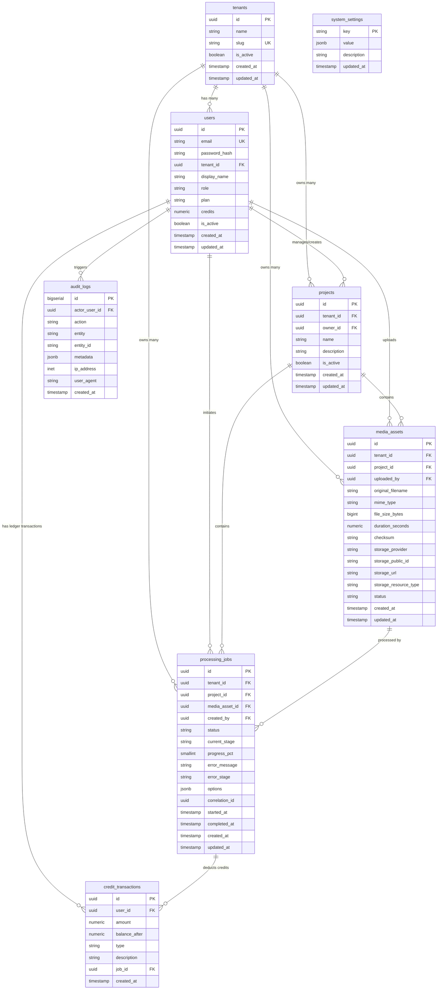
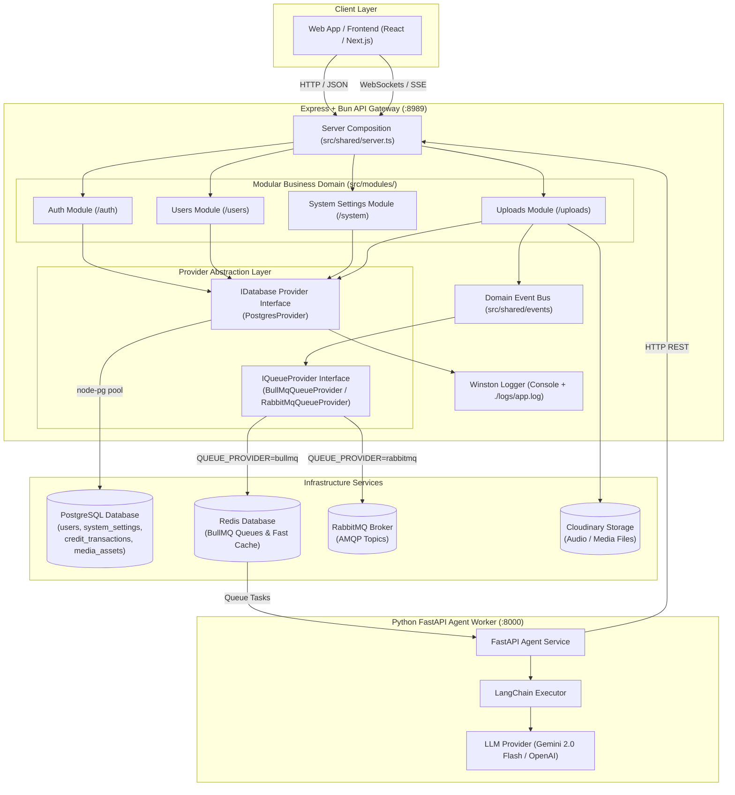

# SpeakTrace Phase 2 Summary & Application Architecture Documentation

## 🚀 PHASE 2 COMPLETED SUMMARY

### 1. SaaS Data Model & Credit System
- **Self-Registration with Initial Credits**: New users self-registering via `POST /api/v1/auth/register` automatically receive **100 initial free credits** (configurable via `system_settings`).
- **User Roles & Subscription Plans**:
  - `role`: `'admin'` | `'member'`
  - `plan`: `'free'` | `'pro'` | `'enterprise'`
  - `credits`: `NUMERIC(12, 2)` balance tracking.
- **Credit Transaction Ledger (`credit_transactions`)**: Every credit movement (welcome bonus, job processing deduction, top-ups, admin grants) is tracked in an immutable ledger with timestamps, amounts, balance-after values, transaction types, and job references.
- **Dynamic Credit Cost Calculation**: Per-job audio processing credit cost calculated dynamically in `UploadsService` prior to execution:
  - Transcription: **2 credits/min**
  - Diarization: **3 credits/min**
  - Enrichment (Emotion/Punctuation): **2 credits/min**
  - RAG Indexing: **5 credits/job**
  - Custom Export: **1 credit/job**

---

### 2. System Settings Table (`system_settings`)
- Created key-value JSON storage table (`key TEXT PRIMARY KEY, value JSONB NOT NULL, description TEXT, updated_at TIMESTAMPTZ`).
- Exposed management service (`SystemSettingsService`) and HTTP API endpoints:
  - `GET /api/v1/system/settings`: Returns active system settings.
  - `PATCH /api/v1/system/settings/:key`: Allows updates to dynamic system settings.

---

### 3. Database Migration & Seeding
- **Migration**: [1779966960000_system_settings_and_credits.sql](file:///home/piush/Prog/proj/speaktrace/api/src/shared/database/migrations/1779966960000_system_settings_and_credits.sql) creates `system_settings`, updates `users` (`credits`, `plan`), and creates `credit_transactions`.
- **Seed Script**: [bun run db:seed](file:///home/piush/Prog/proj/speaktrace/api/src/scripts/seed.ts) populates default settings, Super Admin (`admin@speaktrace.com`), normal user (`user@speaktrace.com`), and paid user (`paid@speaktrace.com`).

---

### 4. Dynamic Queue Provider Pattern (`BullMQ` vs. `RabbitMQ`)
- Analyzed infrastructure dependencies: **RabbitMQ is NOT strictly necessary**. BullMQ (backed by Redis) provides complete queue management, retries, backoffs, and concurrency for SpeakTrace using the existing Redis instance.
- Abstracted event publishing (`events.ts`) and event consumers (`eventConsumers.ts`) to use `getQueueProvider()`.
- Users can switch providers seamlessly in `api/.env`:
  ```env
  QUEUE_PROVIDER=bullmq   # Redis queue backend (default, recommended)
  # QUEUE_PROVIDER=rabbitmq # AMQP queue backend
  ```

---

### 5. SQL Query & Transaction Logging Wrapper
- Enhanced `PostgresProvider.query()` and `BaseRepository.transaction()`.
- Automatically formats single-line SQL queries, logs query execution duration (`ms`), stringifies parameters, and records returned row counts.
- Outputs live colorized logs to **console** (`[SQL]` / `[SQL:TX]`) and streams persistent logs to **`./logs/app.log`** via Winston file transport.

---

## 🗄️ DATABASE SCHEMA & ENTITY RELATIONSHIPS

### 1. Entity Relationship Diagram (ERD)



---

### 2. Comprehensive Data Dictionary

#### A. `system_settings`
- **Purpose**: Key-value JSON table for dynamic system configurations, credit unit costs, and default signup bonuses.
- **Columns**:
  - `key` (`TEXT PRIMARY KEY`): Unique setting identifier (e.g. `'default_free_credits'`, `'credit_cost_per_minute_transcription'`).
  - `value` (`JSONB NOT NULL`): Dynamic JSON value (numbers, booleans, strings, or structured objects).
  - `description` (`TEXT`): Human-readable explanation of what the setting controls.
  - `updated_at` (`TIMESTAMPTZ NOT NULL DEFAULT NOW()`): Last update timestamp.

#### B. `users`
- **Purpose**: Stores user identities, authentication credentials, role authorization, subscription plan level, and current credit balance.
- **Columns**:
  - `id` (`UUID PRIMARY KEY DEFAULT gen_random_uuid()`): Primary key.
  - `email` (`TEXT NOT NULL UNIQUE`): User email address.
  - `password_hash` (`TEXT NOT NULL`): PBKDF2-SHA512 hashed password.
  - `tenant_id` (`UUID REFERENCES tenants(id)`): Multi-tenancy isolation reference.
  - `display_name` (`TEXT`): User full/display name.
  - `role` (`TEXT NOT NULL DEFAULT 'member'`): Authorization role (`'admin'` | `'member'`).
  - `plan` (`TEXT NOT NULL DEFAULT 'free'`): SaaS plan level (`'free'` | `'pro'` | `'enterprise'`).
  - `credits` (`NUMERIC(12, 2) NOT NULL DEFAULT 0.00`): Current available credit balance.
  - `is_active` (`BOOLEAN NOT NULL DEFAULT TRUE`): Account activation flag.
  - `created_at` / `updated_at`: Timestamps.

#### C. `credit_transactions`
- **Purpose**: Immutable ledger tracking every credit movement (grants, usage deductions, welcome bonuses, top-ups).
- **Columns**:
  - `id` (`UUID PRIMARY KEY DEFAULT gen_random_uuid()`): Transaction ID.
  - `user_id` (`UUID NOT NULL REFERENCES users(id)`): Target user ID.
  - `amount` (`NUMERIC(12, 2) NOT NULL`): Positive for grants/top-ups, negative for job processing deductions.
  - `balance_after` (`NUMERIC(12, 2) NOT NULL`): Snapshot of credit balance after transaction applied.
  - `type` (`TEXT NOT NULL`): Category (`'welcome_bonus'`, `'job_processing'`, `'admin_grant'`, `'topup'`).
  - `description` (`TEXT`): Human-readable reason for credit movement.
  - `job_id` (`UUID REFERENCES processing_jobs(id)`): Associated job ID if type is `'job_processing'`.
  - `created_at` (`TIMESTAMPTZ NOT NULL DEFAULT NOW()`): Transaction timestamp.

#### D. `media_assets`
- **Purpose**: File metadata table storing references to uploaded audio and video files.
- **Columns**:
  - `id` (`UUID PRIMARY KEY`): Media ID.
  - `tenant_id` / `project_id` / `uploaded_by`: Scoping foreign keys.
  - `original_filename` (`TEXT`): File name on user device.
  - `mime_type` (`TEXT`): File MIME type (e.g. `'audio/mp3'`, `'video/mp4'`).
  - `file_size_bytes` (`BIGINT`): File size.
  - `duration_seconds` (`NUMERIC(10, 3)`): Audio duration probed from file header.
  - `storage_provider` (`TEXT DEFAULT 'cloudinary'`): Storage backend (`'cloudinary'` | `'s3'`).
  - `storage_public_id` / `storage_url`: Cloud object storage keys and URLs.
  - `status` (`TEXT DEFAULT 'uploaded'`): Asset state (`'uploaded'` | `'validated'` | `'failed_validation'`).

#### E. `processing_jobs`
- **Purpose**: State machine tracking the multi-stage asynchronous processing pipeline for each upload.
- **Columns**:
  - `id` (`UUID PRIMARY KEY`): Job ID.
  - `tenant_id` / `project_id` / `media_asset_id` / `created_by`: Foreign keys.
  - `status` (`TEXT DEFAULT 'UPLOADED'`): Pipeline state enum (`'UPLOADED'`, `'MEDIA_VALIDATED'`, `'AUDIO_EXTRACTED'`, `'DIARIZATION_DONE'`, `'AWAITING_SPEAKER_MAPPING'`, `'TRANSCRIPTION_IN_PROGRESS'`, `'COMPLETED'`, `'FAILED'`).
  - `current_stage` (`TEXT`): Human-readable current pipeline stage.
  - `progress_pct` (`SMALLINT DEFAULT 0`): Percentage progress (0 - 100%).
  - `options` (`JSONB DEFAULT '{}'`): User-requested feature options (`emotion_tagging`, `diarization`, `rag_indexing`, `custom_export`).
  - `correlation_id` (`UUID`): Distributed tracing correlation ID.
  - `started_at` / `completed_at`: Timestamps.

#### F. `tenants` & `projects`
- **`tenants`**: B2B multi-tenancy organization table (`id`, `name`, `slug`, `is_active`).
- **`projects`**: Organization folders grouping media assets and jobs per tenant (`id`, `tenant_id`, `owner_id`, `name`).

#### G. `audit_logs`
- **`audit_logs`**: System audit trail (`id`, `actor_user_id`, `action`, `entity`, `entity_id`, `metadata`, `ip_address`, `user_agent`).

---

### 3. Future Database Schema Extensions

When implementing upcoming product phases, create new migrations in `api/src/shared/database/migrations/`:

1. **Phase 3 (Speaker Workflow)**:
   - Create `speaker_profiles` (`id`, `job_id`, `speaker_tag`, `label`, `sample_audio_url`, `embedding_vector`).
2. **Phase 4 (Enrichment & Transcripts)**:
   - Create `transcript_segments` (`id`, `job_id`, `speaker_label`, `start_time`, `end_time`, `text`, `emotion`, `confidence`).
   - Create `custom_grammar_templates` (`id`, `user_id`, `name`, `template_string`).
3. **Phase 5 (LLM + RAG Conversational Q&A)**:
   - Enable `pgvector` extension.
   - Create `transcript_embeddings` (`id`, `job_id`, `chunk_text`, `vector embedding(1536)`).
   - Create `chat_sessions` & `chat_messages` (`id`, `user_id`, `job_id`, `role`, `content`, `citations`).

---

## 🏗️ SYSTEM ARCHITECTURE DIAGRAM



---

## 🔌 THE PROVIDER PATTERN ARCHITECTURE

### 1. How the Provider Pattern Works
The Provider Pattern decouples business logic from specific third-party libraries or infrastructure backends. Rather than instantiating raw client libraries (e.g. `ioredis`, `amqplib`, `pg`) directly inside service logic, the application depends on a contract interface (e.g. `IQueueProvider`, `IDatabase`).

#### Key Benefits:
1. **Zero Lock-in**: Switch backends without editing business domain code.
2. **Easy Testing**: Swap real database/queue connections with mock objects in unit tests.
3. **Environment Agnostic**: Run BullMQ in local dev and RabbitMQ in production simply by toggling environment variables.

---

### 2. How to Change Providers in Configuration
To switch between queue backends, update `api/.env`:

```env
# Switch to BullMQ (Redis-backed queue)
QUEUE_PROVIDER=bullmq

# Or switch to RabbitMQ (AMQP topic exchange)
QUEUE_PROVIDER=rabbitmq
```

The system automatically initializes the correct provider class at startup via `getQueueProvider()` in `src/shared/queue/queue.ts`.

---

### 3. Step-by-Step: How to Build a Custom Provider in the Future

If you want to add a new provider (for example, an **AWS S3 Storage Provider**, a **Kafka Queue Provider**, or a **MySQL Database Provider**), follow this standard 4-step workflow:

#### Step 1: Define the Abstract Interface Contract
Create or update the provider contract in `src/shared/<domain>/<domain>.ts`.

```typescript
// Example: src/shared/storage/storage.ts
export interface StorageUploadInput {
    fileName: string;
    buffer: Buffer;
    mimeType: string;
}

export interface IStorageProvider {
    readonly name: string;
    upload(input: StorageUploadInput): Promise<{ publicId: string; url: string }>;
    delete(publicId: string): Promise<void>;
}
```

#### Step 2: Implement the Custom Provider Class
Create your implementation in `src/shared/<domain>/providers/custom.provider.ts`.

```typescript
// Example: src/shared/storage/providers/s3.provider.ts
import { S3Client, PutObjectCommand } from "@aws-sdk/client-s3";
import type { IStorageProvider, StorageUploadInput } from "../storage";

export class S3StorageProvider implements IStorageProvider {
    readonly name = "s3";
    private client: S3Client;

    constructor() {
        this.client = new S3Client({ region: process.env.AWS_REGION });
    }

    async upload(input: StorageUploadInput) {
        // Implementation details...
        return { publicId: input.fileName, url: `https://s3.amazonaws.com/${input.fileName}` };
    }

    async delete(publicId: string) {
        // Implementation details...
    }
}
```

#### Step 3: Create the Provider Factory Function
Expose a factory function that inspects configuration/environment variables to instantiate the selected provider.

```typescript
// Example: src/shared/storage/storage.ts
import { env } from "~/config/env";
import { CloudinaryStorageProvider } from "./providers/cloudinary.provider";
import { S3StorageProvider } from "./providers/s3.provider";

let instance: IStorageProvider | null = null;

export function getStorageProvider(): IStorageProvider {
    if (instance) return instance;

    if (env.STORAGE_PROVIDER === "s3") {
        instance = new S3StorageProvider();
    } else {
        instance = new CloudinaryStorageProvider();
    }

    return instance;
}
```

#### Step 4: Add Environment Validation
Register the new provider name in `src/config/env.ts` and `config.yaml`.

```typescript
// In src/config/env.ts
STORAGE_PROVIDER: z.enum(["cloudinary", "s3"]).default("cloudinary"),
```

---

## 📦 MODULAR APPLICATION ARCHITECTURE

SpeakTrace uses a **Feature-based Modular Architecture**. Every business domain lives inside its own folder under `api/src/modules/`.

```
api/src/modules/
├── auth/          ← Authentication & registration domain
├── users/         ← User profiles, role management, credit ledger
├── system/        ← System settings & cost calculation engine
├── uploads/       ← Media file uploads & job orchestration pipeline
└── index.ts       ← Master HTTP route registration shim
```

### Anatomy of a Module
Inside each feature module, responsibilities are cleanly separated into dedicated single-responsibility files:

| File Pattern | Layer | Responsibilities |
|---|---|---|
| `<name>.routes.ts` | **HTTP Routing** | Express router definition, middleware attachment (`authenticate`, `validate`), dependency injection wiring. |
| `<name>.controller.ts` | **HTTP Transport** | Extracts request parameters/body, calls service methods, formats JSON response using `successResponse()`. |
| `<name>.service.ts` | **Business Logic** | Core domain logic, validation checks, credit cost calculations, triggering events. |
| `<name>.repository.ts` | **Data Access** | Pure SQL queries (`this.db.query`), transaction handling, row parsing using Zod schemas. |
| `<name>.types.ts` | **Data Transfer Objects** | TypeScript interfaces for DTOs, request inputs, and API responses. |
| `<name>.validator.ts` | **Validation** | Zod schemas for request body, query parameters, and route params. |
| `<name>.errors.ts` | **Domain Errors** | Custom error classes extending `BadRequestError`, `NotFoundError`, or `UnauthorizedError`. |
| `<name>.events.ts` | **Event Handling** | Event bus subscribers listening for background triggers or socket emissions. |

---

## 🛠️ CONVENTIONS FOR ADDING NEW MODULES

When adding a new module (e.g. `speakers`, `transcripts`, or `exports`):
1. **Directory**: Create `api/src/modules/<feature_name>/`.
2. **Repository**: Extend `BaseRepository`. All database queries MUST go inside `<feature>.repository.ts`.
3. **Service**: Put all business logic in `<feature>.service.ts`. Never put SQL inside services or controllers.
4. **Controller**: Wrap all async route handlers with `asyncHandler(...)` from `~/shared/utils/asyncHandler`.
5. **Route Registration**: Export `create<Feature>Router()` and register it in `api/src/modules/index.ts`.
6. **Documentation**: Add TypeSpec / OpenAPI path definitions in `<feature>.openapi.ts`.

---

## 📊 VERIFICATION & QUALITY CHECKS

- **TypeScript Safety**: `bun run typecheck` → **PASSED (0 errors)**.
- **Code Style & Formatting**: `bun run lint:fix` → **PASSED (0 errors)**.
- **Database Migrations**: `bun run db:migrate:status` → **PASSED (dry-run verified)**.
- **Seeding Execution**: `bun run db:seed` → **PASSED (admin, system settings, users created)**.
